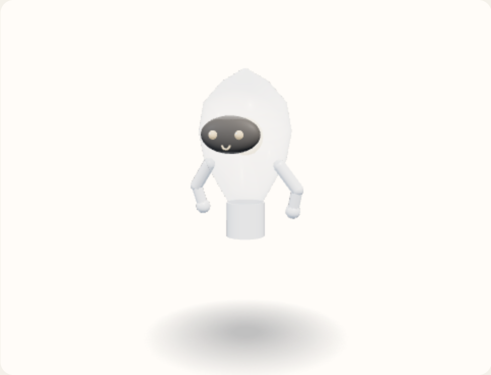

# Helferlein

[](LICENSE)

Helferlein is an animated 3D avatar, built on [Three.js](https://threejs.org/), that a web page can summon as a visible helper. The name is everyday German for “little helper.” The page calls it into view: it swoops in from a small resting form, floats and idles while it waits, and holds a working pose while work is in progress. When the page says the finished work is on screen (the `applied` event), it spins, and a randomized new look appears while its back faces you. Dismissed, it folds back into the resting form.

A new look is one roll. It changes the hue and one or two of the body, the expression, the clothes, a tool in hand, and one extra such as bunny ears or a hat, never all of them. The colors of all parts are computed from that one hue, so they harmonize. Something that just changed sits out the next roll, and a new tool, new clothes, or a new extra stays for a while. The first look is a plain android with no clothes, no tool, and no extra. The rules are in [SPEC.md, section 6](SPEC.md#6-host-contract).

Helferlein draws only the figure. The page that embeds it (the *host*) owns everything around it: the chat, the panel, the navigation, the background.

- [Specification](SPEC.md): product spec, host contract, catalog
- [Third-party notices](THIRD_PARTY_NOTICES.md): the vendored Three.js build and its license

## Status

The figure, the host contract, and the demo are implemented and covered by tests (`node --test`). The catalog has eight bodies, five rollable expressions, six garments, twelve tools, and fourteen extras. Still open, from [SPEC.md, section 10](SPEC.md#10-open): the base drawing, the lightness and chroma numbers per color role, another pass at the tool meshes and how each tool is held, and the placement of some extras. Helferlein has no release and no package yet; you use it from a checkout.

## Screenshots

Screenshots from the visual prototype (`prototype/helferlein.prototype.html`), with its provisional colors: the android, the lightbulb, the suit, and bunny ears.

<p>
  
  
  
  
</p>

More, one page per part with the code that drew it: [bodies](design/prototype/bodies), [clothes](design/prototype/clothes), [tools](design/prototype/tools), [extras](design/prototype/extras).

## Quick start

Needs a browser with WebGL. Nothing to install: `package.json` declares no dependencies, and Three.js r160 is vendored as `prototype/three.min.js`.

The pages load ES modules, so serve the checkout over HTTP; opening the files directly (`file://`) does not work. From the repository root:

```bash
git clone https://github.com/pihme/helferlein.git
cd helferlein
python3 -m http.server 8000     # or any static file server
```

Then open:

- <http://localhost:8000/demo/demo.html>: **Demo.** The page explains the avatar; the resting figure sits in the bottom right. Click it to summon it and open a chat. A message makes the figure work, then a fixed sample reply comes back (no model is called), the figure turns, and while its back faces you the page reloads with a new look and a new background. Closing the chat dismisses it.
- <http://localhost:8000/demo/wardrobe.html>: **Wardrobe.** Body, face, and color on the left, clothes, tool, and extra on the right. **Randomize** runs one roll, the same roll the demo uses; choosing a part plays the same turn. Drag the figure to turn it.
- <http://localhost:8000/prototype/helferlein.prototype.html>: the throwaway visual prototype, not the product.

Both demo pages share the stored roll in the browser's local storage (key `helferlein-demo`).

## Embedding

The figure is one module, [`src/figure.js`](src/figure.js), plus the vendored Three.js build loaded as a classic script. No UI framework.

```html
<div id="helper" style="width: 320px; height: 360px"></div>
<script src="prototype/three.min.js"></script>
<script type="module">
  import { mount } from "./src/figure.js";

  const figure = mount(document.getElementById("helper"), globalThis.THREE);

  // Restore the look the page kept from last time, if any.
  const saved = localStorage.getItem("helferlein");
  if (saved) figure.setBlob(JSON.parse(saved));

  figure.summon();                 // swoop in, then idle
  figure.working();                // working pose while your page does its work
  await figure.applied();          // the result is on the page: spin, new look
  localStorage.setItem("helferlein", JSON.stringify(figure.getBlob()));
  figure.dismiss();                // fold back into the resting form
</script>
```

`mount(element, THREE)` draws into `element` (a container, or a `<canvas>`) and sizes the canvas to it, so give the element a size. It throws if Three.js did not load. It sets the CSS variable `--mesh-pad` on the element: the fraction of the view below the figure's lowest point, for placing it against an edge.

### Host events

The host drives every motion; the avatar watches no files, processes, or network calls. [SPEC.md, section 6](SPEC.md#6-host-contract) is the contract.

| Call | What the figure does |
| --- | --- |
| `summon()` | Swoops out of the resting form, then idles. |
| `working()` | Working pose; the face pulses between focused and determined. Only while summoned. |
| `idle()` | Back to idle from working, look kept: a finished turn that was not applied. |
| `applied()` | Only after `working()`. Rolls a new look and spins; the look switches while the back faces the viewer. Returns a promise that resolves when the spin ends. |
| `applied({ look, memory })` | Spins to a roll the host already made, for example with `rollFrom` from `src/roll.js`, as the demo does. |
| `dismiss()` | Folds back into the resting form, with the resting face. A dismiss before the back faces the viewer keeps the previous look. |

*Applied* means the finished work is what the person now sees, for example after the host reloaded the page. It is the only event that rolls a new look.

### The stored roll

The look and its memory (what just changed, the locks, the absent streaks) are one plain JSON blob, `{ look, memory }`. The host decides where to keep it.

| Call | Use |
| --- | --- |
| `getBlob()` | The current blob. |
| `setBlob(blob)` | Restores a blob without a spin. A blob with unknown or missing fields is rejected with an error. The wardrobe's hue slider uses it. |
| `watchReveal(fn)` | Calls `fn` once, at the moment the new look appears during the next spin. The demo saves the roll and reloads the page there. |
| `returnFromBack()` | After such a reload: the figure starts facing away and turns back to the viewer. Returns a promise. |
| `setLook(partial)` | Sets parts of the look directly, for example `{ hue: 30 }`, without a spin. The memory is kept. |
| `turn(yaw, pitch)` | Rotates the figure by the given radians; pitch stops at 70°. The wardrobe uses it for dragging. |
| `dispose()` | Stops the animation loop and frees the renderer. |

## Tests

Needs Node.js (the tests use the built-in `node:test`; no install step).

```bash
npm test          # same as: node --test
```

The tests cover the roll rules, the blob validation, the state machine, the catalog, the demo store, and the figure built against Three.js with a stubbed canvas.

## Layout

| Path | Contents |
| --- | --- |
| `src/figure.js` | `mount`: renderer, scene, camera, the animation loop, and the host calls |
| `src/machine.js` | The host-event state machine (summon, working, idle, applied, dismiss) |
| `src/roll.js` | The catalog lists, the default look, and `rollFrom`, one roll with sit-outs, locks, and streaks |
| `src/blob.js` | `readBlob` and `writeBlob`: validation of the stored roll |
| `src/draw.js` | The meshes: bodies, faces, clothes textures, tools, extras, and their colors |
| `src/catalog.js` | The registry each body, garment, tool, and extra is added to |
| `src/motion.js` | The spin, the working face pulse, ear flicks, and the named rig points |
| `demo/` | The included host: `demo.html` (chat), `wardrobe.html`, their scripts, the stored state (`store.js`), and the part icons |
| `prototype/` | The visual prototype and the vendored `three.min.js` (r160) |
| `assets/` | Reference sketches of the shape (SVG): [sheet](assets/helferlein-poses.svg), [resting](assets/helferlein-lamp.svg), [idle](assets/helferlein-idle.svg), [thinking](assets/helferlein-thinking.svg), [applied](assets/helferlein-applied.svg). Concept art, not the design |
| `design/` | Prototype notes per part, the tool grips (`holds.md`), and the implementation plan |
| `test/` | `node:test` suites |

## Third-party software

Helferlein contains one third-party component, the Three.js r160 build in `prototype/three.min.js` (MIT). Its license and the rest of the inventory: [THIRD_PARTY_NOTICES.md](THIRD_PARTY_NOTICES.md).

## How this project is built

Helferlein is developed agent-first. AI coding agents write all code,
tests, and documentation, and review each other's changes, under human
direction: specs, design decisions, and acceptance based on observed
behaviour and test results. No human reads the code line by line. This
is a deliberate choice. Quality rests on automated tests, CI, and
independent agent review.

Evaluate the code against your own requirements before you depend on it.
Found a problem? Open an issue.

## License

[PolyForm Noncommercial License 1.0.0](LICENSE). Source-available; not OSI Open Source. Commercial use is not granted. Other licenses can be negotiated with the copyright holder.
