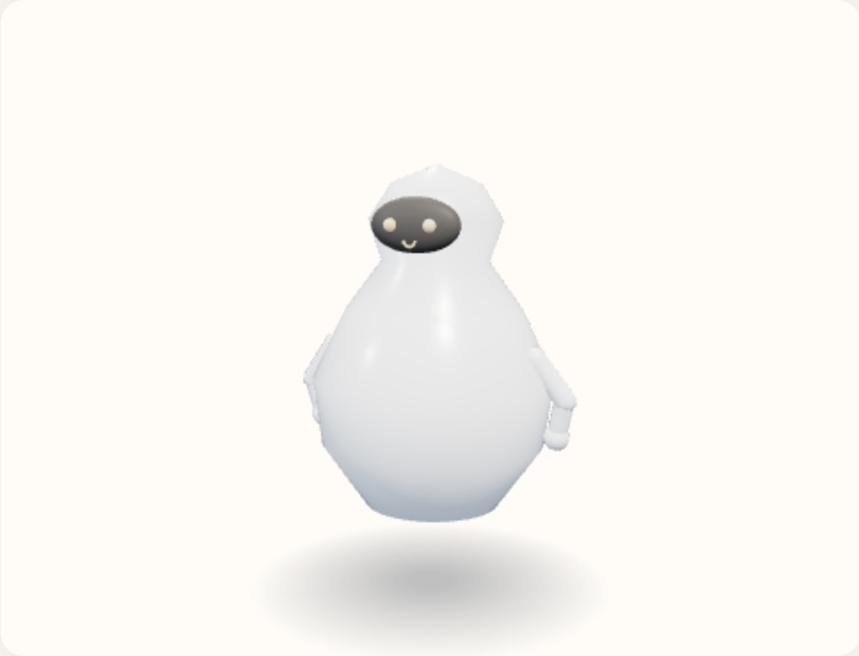

# Pear

Small head, wide torso. The body is the lathe only: no stem and no leaf.



View B, summoned, idle. Neutral expression. No clothes, tool, or extra. Hue 32°, provisional.

Copied from `shapeBody` in `prototype/helferlein.prototype.html`.

```javascript
g.add(lathe([
  [0.01, 0.32], [0.30, 0.42], [0.50, 0.70], [0.54, 1.00], [0.40, 1.30],
  [0.24, 1.52], [0.30, 1.70], [0.20, 1.86], [0.01, 1.94]
], material));
place = { faceY: 1.68, faceZ: 0.24, faceR: 0.26, headTop: 1.94, shoulderY: 1.12, bodyR: 0.5 };
```
