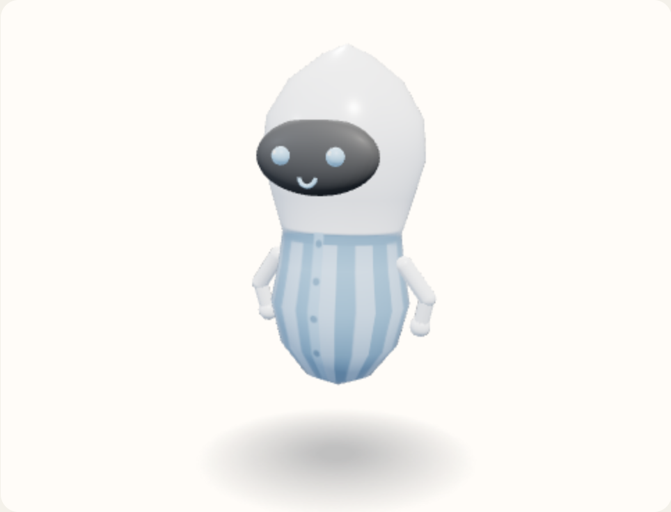

# Pleated shirt

Vertical pleats around the torso, a darker band at the collar, and buttons down the center front.



View B, the reference android, summoned and idle. Neutral expression. No tool or extra. Hue 210°, provisional.

The pleats alternate a lighter and a darker shade of the clothes hue, 22 around the body. The collar is the top 0.06 of the garment. The placket and the five buttons are drawn on the canvas after the pixels, centered at `u` 0.5.

Copied from `clothesMap` in `prototype/helferlein.prototype.html`.

```javascript
if (name === "Pleated shirt") {
  px = Math.floor(u * 22) % 2 ? pleatHi : pleatLo;
  if (fig > neck - 0.06) px = ribPx;
}
```

```javascript
const placket = bytes(shade(cloth, 0.05));
ctx.fillStyle = `rgb(${placket[0]},${placket[1]},${placket[2]})`;
const x0 = Math.floor(0.488 * w);
const yTop = (1 - (neck - y0) / span) * (h - 1);
const yHem = (1 - (hem - y0) / span) * (h - 1);
ctx.fillRect(x0, yTop, Math.ceil(0.024 * w), yHem - yTop);
ctx.fillStyle = `rgb(${edgePx[0]},${edgePx[1]},${edgePx[2]})`;
for (let i = 0; i < 5; i++) {
  const fig = hem + 0.1 + i * (neck - hem - 0.16) / 4;
  const cy = (1 - (fig - y0) / span) * (h - 1);
  ctx.beginPath();
  ctx.arc(w / 2, cy, 4.5, 0, Math.PI * 2);
  ctx.fill();
}
```
