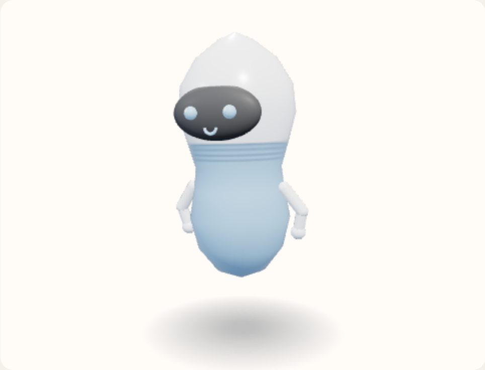

# Turtleneck

A plain torso with a ribbed collar that climbs closer to the face than the other shirts. A short rib sits at the hem.



View B, the reference android, summoned and idle. Neutral expression. No tool or extra. Hue 210°, provisional.

The collar stays under the visor. Its top is `min(faceY - faceR * 0.22, neck + 0.18)`.

Copied from `clothesMap` in `prototype/helferlein.prototype.html`.

```javascript
if (name === "Turtleneck") neck = Math.min(place.faceY - place.faceR * 0.22, neck + 0.18);
```

```javascript
} else if (name === "Turtleneck") {
  const rib = fig > neck - 0.16 && Math.floor((neck - fig) / 0.02) % 2 === 0;
  const hemRib = fig < hem + 0.06 && Math.floor((fig - hem) / 0.02) % 2 === 0;
  px = rib || hemRib ? ribPx : clothPx;
}
```
