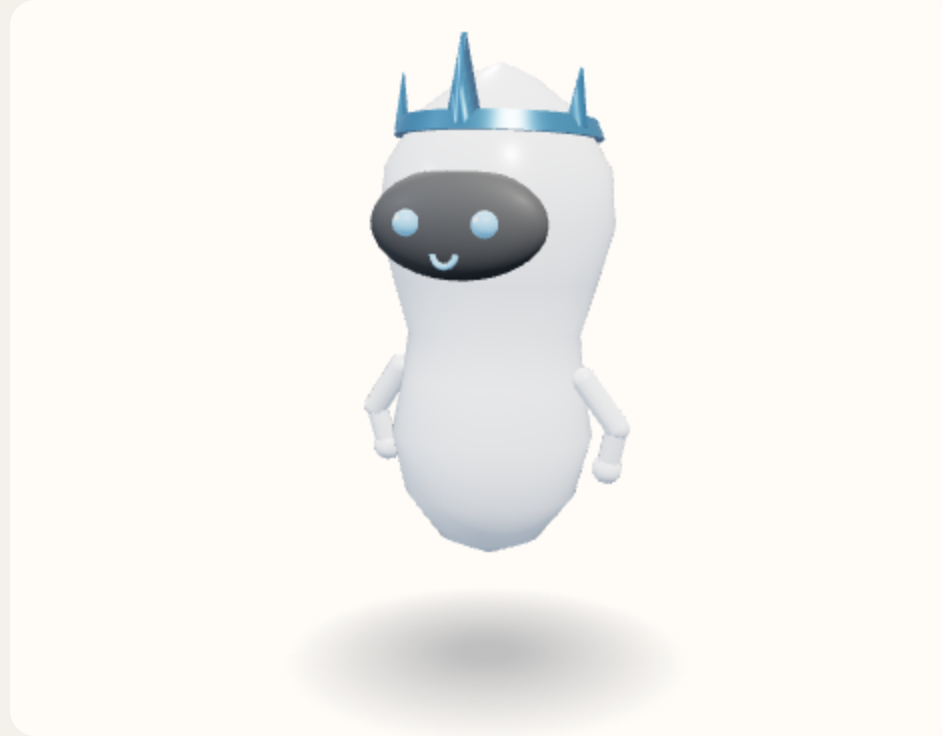

# Crown

A metal band with five flat triangular points. The front point is the tall one, and the head shows through the middle. Worn, so it takes the accessories color. This is not the halo.



View B, the reference android, summoned and idle. Neutral expression. No clothes or tool. Hue 210°, provisional.

Copied from `addExtra` in `prototype/helferlein.prototype.html`.

```javascript
        } else if (name === "Crown") {
          const metal = paint(look, "accessories", { metalness: 0.72, roughness: 0.28 });
          const seat = top - 0.20 * s;
          put(solid(new THREE.CylinderGeometry(0.36 * s, 0.39 * s, 0.07 * s, 24), metal), 0, seat, 0);
          for (let i = 0; i < 5; i++) {
            const a = (i / 5) * Math.PI * 2;
            const h = (0.16 + 0.14 * Math.max(0, Math.cos(a))) * s;
            const peak = solid(new THREE.CylinderGeometry(0.01 * s, 0.08 * s, h, 3), metal);
            peak.scale.z = 0.38;
            peak.rotation.y = a;
            peak.position.set(Math.sin(a) * 0.36 * s, seat + h * 0.45, Math.cos(a) * 0.36 * s);
            g.add(peak);
          }
        }
```
