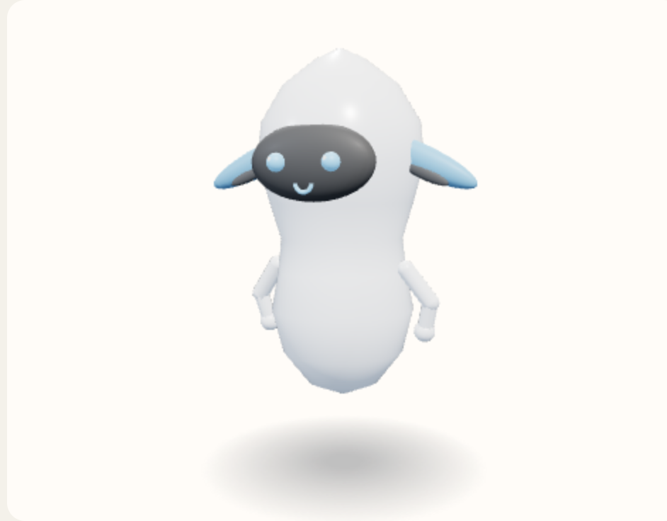

# Dog ears

Large ears that hang beside the cheeks, with a darker inner ear. Grown, so they take the features color. Each ear is hinged where it meets the head. On the live views one ear gives a short double snap, then both rest for about ten seconds. Which ear, and the exact rest, is chosen at random. The inner ear moves with the outer one.



View B, the reference android, summoned and idle. Neutral expression. No clothes or tool. Hue 210°, provisional.

Copied from `addExtra` in `prototype/helferlein.prototype.html`.

```javascript
        } else if (name === "Dog ears") {
          [-1, 1].forEach(side => {
            const lean = side * 1.15;
            const H = 0.16 * s * 2.15;
            const rig = new THREE.Group();
            rig.name = "ear";
            rig.position.set(side * (r * 1.02) - Math.sin(lean) * H, y + 0.02 * s + Math.cos(lean) * H, 0.07);
            rig.rotation.z = rig.userData.base = lean;
            rig.userData.amp = side * 0.42;
            rig.userData.side = side;
            g.add(rig);
            const ear = sphere(0.16 * s, m, 16);
            ear.scale.set(0.5, 2.15, 0.34);
            ear.position.y = -H;
            rig.add(ear);
            const inner = sphere(0.095 * s, faceMat, 12);
            inner.scale.set(0.34, 1.4, 0.18);
            const px = side * r * 0.14, py = -0.08 * s, c = Math.cos(lean), sn = Math.sin(lean);
            inner.position.set(px * c + py * sn, -H - px * sn + py * c, 0.04);
            rig.add(inner);
          });
        }
```
