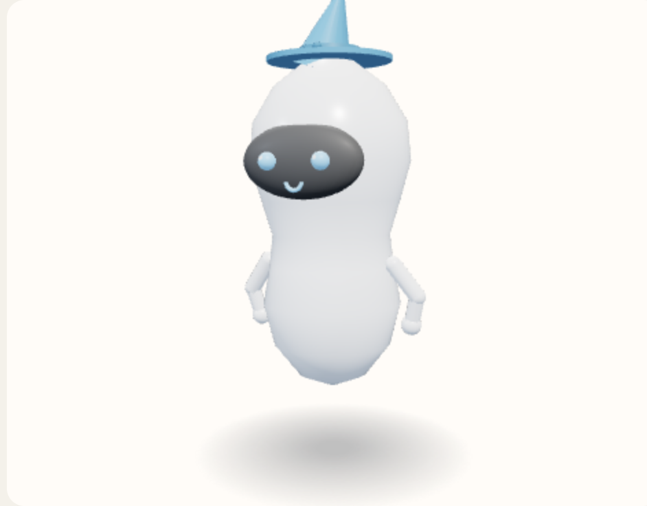

# Pointed hat

A wide brim and a cone that leans, with a band and a small ball at the front. Worn, so it takes the accessories color.



View B, the reference android, summoned and idle. Neutral expression. No clothes or tool. Hue 210°, provisional.

Copied from `addExtra` in `prototype/helferlein.prototype.html`.

```javascript
        } else if (name === "Pointed hat") {
          put(solid(new THREE.CylinderGeometry(0.34 * s, 0.34 * s, 0.03, 24), m), 0, top - 0.01, 0);
          const cone = put(solid(new THREE.ConeGeometry(0.17 * s, 0.46 * s, 18), m), 0.02 * s, top + 0.16 * s, 0);
          cone.rotation.z = -0.28;
          put(solid(new THREE.CylinderGeometry(0.16 * s, 0.18 * s, 0.045 * s, 18), band), 0, top + 0.03 * s, 0);
          put(sphere(0.026 * s, band, 8), 0, top + 0.035 * s, 0.17 * s);
        }
```
