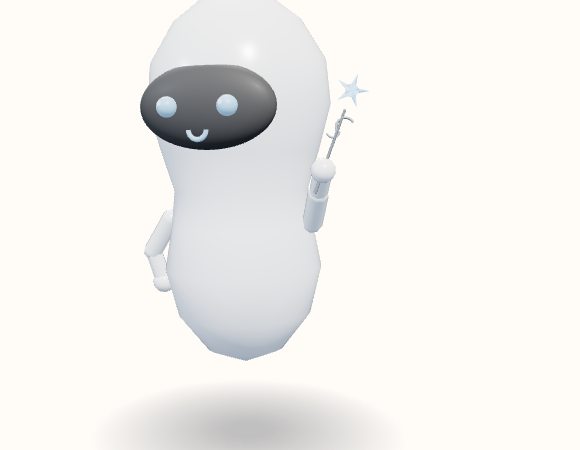

# Fairy wand

A thin stick, two ribbon arcs, and a flat five-point star. The arm is raised and the star is up. The star uses the features accent. The ribbons are a lighter shade of the tool hue.



View B, the reference android, summoned and idle. Neutral expression. No clothes or extra. Hue 210°, provisional.

```javascript
"Fairy wand": { roll: 1.2, grip: [0, 0.10, 0], arm: [0.75, 2.80, 0] },
```

Copied from `makeTool`.

```javascript
} else if (name === "Fairy wand") {
  add(solid(new THREE.CylinderGeometry(0.006, 0.008, 0.44, 8), m), 0.2);
  const ribbon = add(solid(new THREE.TorusGeometry(0.045, 0.006, 6, 14, Math.PI), lite), 0.34, 0.03);
  ribbon.rotation.z = 0.8;
  const tail = add(solid(new THREE.TorusGeometry(0.032, 0.005, 6, 12, Math.PI * 0.85), lite), 0.3, -0.02);
  tail.rotation.z = -2.4;
  for (let i = 0; i < 5; i++) {
    const a = i * Math.PI * 2 / 5;
    const dx = Math.sin(a);
    const dy = Math.cos(a);
    const point = add(solid(new THREE.ConeGeometry(0.026, 0.12, 4), hot), 0.52 + dy * 0.028, dx * 0.028);
    point.rotation.z = Math.atan2(-dx, dy);
    point.scale.z = 0.32;
  }
}
```
