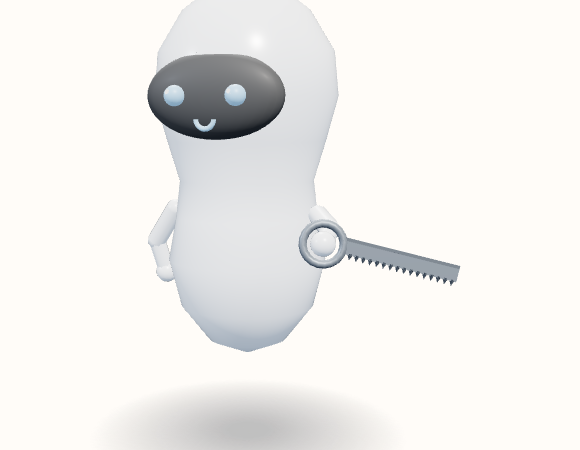

# Saw

The hand passes through the round handle. The blade runs out to the side and the teeth point down.



View B, the reference android, summoned and idle. Neutral expression. No clothes or extra. Hue 210°, provisional.

Teeth sit on local +X, the belly, so they point screen-down when the blade runs across the view.

```javascript
"Saw": { roll: -0.25, grip: [0, 0.02, 0], arm: [-1.35, 0.55, -0.45] },
```

Copied from `makeTool`.

```javascript
} else if (name === "Saw") {
  add(solid(new THREE.TorusGeometry(0.1, 0.02, 8, 20), m), 0.02);
  add(solid(new THREE.BoxGeometry(0.075, 0.58, 0.01), m), 0.4, -0.014);
  add(solid(new THREE.BoxGeometry(0.016, 0.58, 0.014), dark), 0.4, -0.05);
  for (let i = 0; i < 16; i++) {
    const tooth = add(solid(new THREE.ConeGeometry(0.017, 0.032, 3), dark), 0.16 + i * 0.034, 0.032);
    tooth.rotation.z = -Math.PI / 2;
  }
}
```
