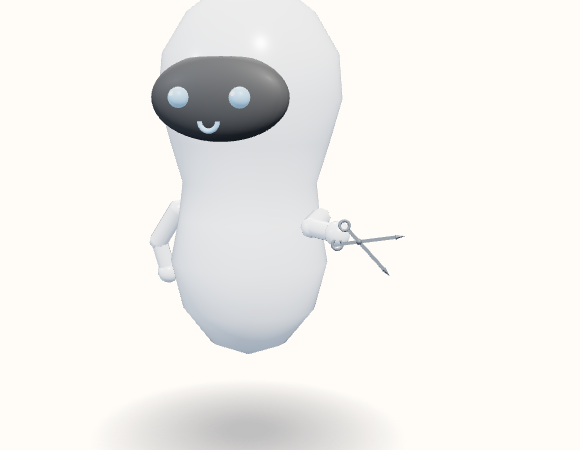

# Scissors

Open blades. Each finger hole sits on its own blade, back from the rivet, so the holes do not meet and a short shank shows between the rivet and the bows. The bows sit just in front of the hand.



View B, the reference android, summoned and idle. Neutral expression. No clothes or extra. Hue 210°, provisional.

The grip’s z is behind the mesh, so the hand stays behind the bows and the holes stay visible.

```javascript
"Scissors": { roll: -0.35, grip: [0, 0.055, -0.05], arm: [-1.50, 0.10, 0.90] },
```

Copied from `makeTool`.

```javascript
} else if (name === "Scissors") {
  add(sphere(0.015, dark, 10), 0.16);
  [-1, 1].forEach(side => {
    const half = new THREE.Group();
    half.position.set(0, 0.16, side * 0.003);
    half.rotation.z = side * -0.48;
    const blade = solid(new THREE.BoxGeometry(0.016, 0.274, 0.006), m);
    blade.position.y = 0.054;
    half.add(blade);
    const tip = solid(new THREE.ConeGeometry(0.011, 0.046, 4), m);
    tip.position.y = 0.2;
    half.add(tip);
    const loop = solid(new THREE.TorusGeometry(0.024, 0.007, 6, 14), m);
    loop.position.set(0, -0.105, 0);
    half.add(loop);
    g.add(half);
  });
}
```
