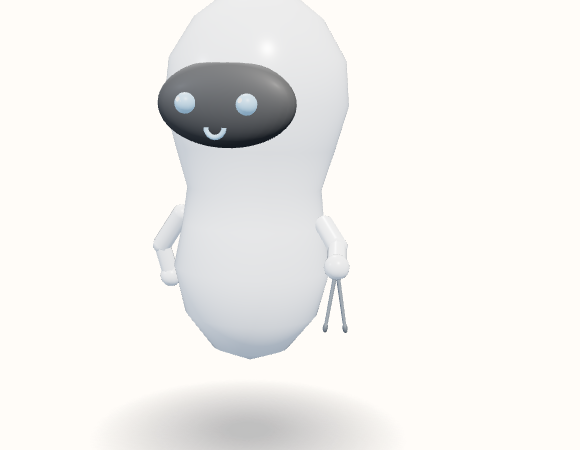

# Tongs

The hand holds the spring and the tips point down. The opening is a narrow V.



View B, the reference android, summoned and idle. Neutral expression. No clothes or extra. Hue 210°, provisional.

```javascript
"Tongs": { roll: -Math.PI / 2, grip: [0, 0.04, 0], arm: [-1.20, 0.55, -0.30] },
```

Copied from `makeTool`.

```javascript
} else if (name === "Tongs") {
  const spring = add(solid(new THREE.TorusGeometry(0.026, 0.009, 6, 12, Math.PI), m), 0.02);
  spring.rotation.z = Math.PI / 2;
  [-1, 1].forEach(side => {
    const pivot = new THREE.Group();
    pivot.position.set(0, 0.04, 0);
    pivot.rotation.z = side * -0.16;
    const arm = solid(new THREE.CylinderGeometry(0.008, 0.01, 0.28, 8), m);
    arm.position.y = 0.14;
    pivot.add(arm);
    const tip = sphere(0.02, dark, 10);
    tip.position.set(0, 0.3, 0);
    tip.scale.set(0.62, 1.2, 0.5);
    pivot.add(tip);
    g.add(pivot);
  });
}
```
